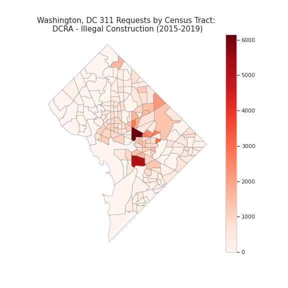
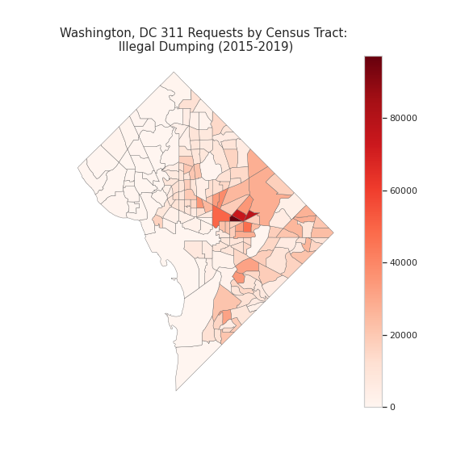
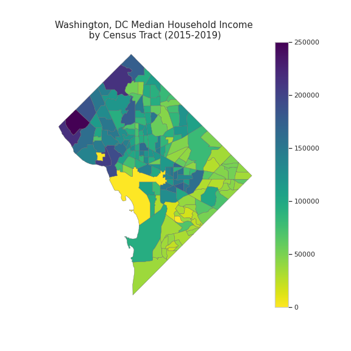
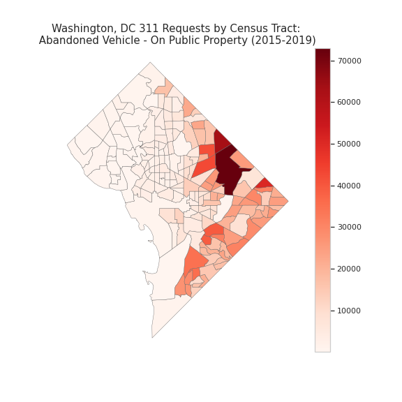

# Visualizing 311 Requests 

This project contains a series of visualizations showing 311 requests in Washington, DC from 2015 to 2019 at the Census tract level. Patterns are uncovered that may allow the city to take targeted, preemptive action and to appropriately distribute resources where they are needed most. For example, as the figure below shows, illegal construction requests and illegal dumping requests are highly concentrated in certain Census tracts. 

Illegal Construction         |  Illegal Dumping          
:-------------------------:|:-------------------------: 
  |            

This project also juxtaposes 311 requests against median household income of the Census tract to visualize whether some 311 requests are more common in lower or higher income Census tracts. For example, the figure below shows all requests for abandoned vehicles on public property. As the figure shows, there are virtually no requests for abandoned vehicles in tracts with a median household income above 250k. The requests are concentrated in Census tracts with median household income below 100k. 

Median Household Income by Census Tract          |  Abandoned Vehicle 311 Requests by Census Tract
:-------------------------:|:-------------------------:
  |   

This project also uses Linear Regression to explore the relationship between median household income of a Census tract and 311 ticket response, controlling for type of request. 

Code for this project can be found in the Jupyter notebook [here](https://github.com/lkreisel/dc_311/blob/main/DC_311_Requests_2015-2019.ipynb). 
